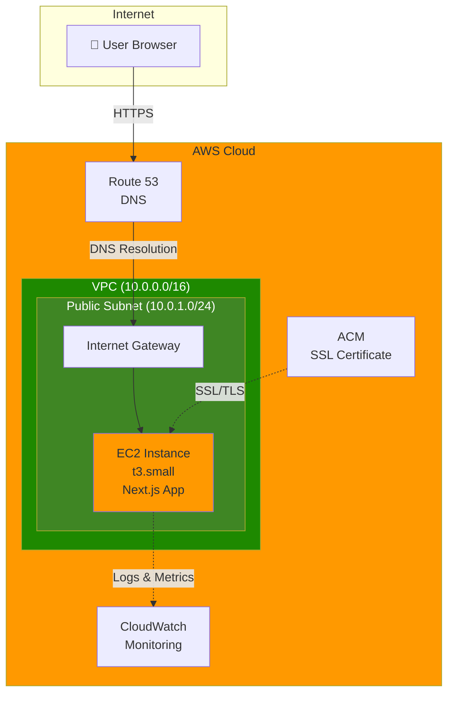
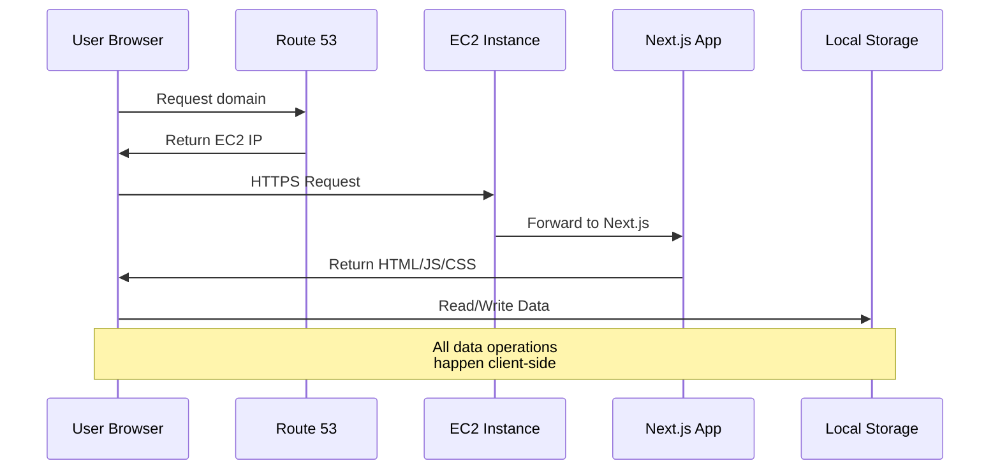
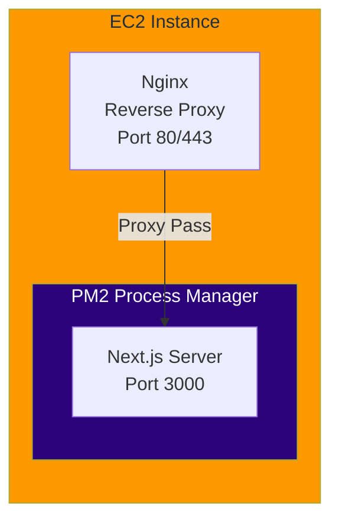
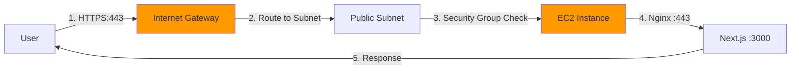
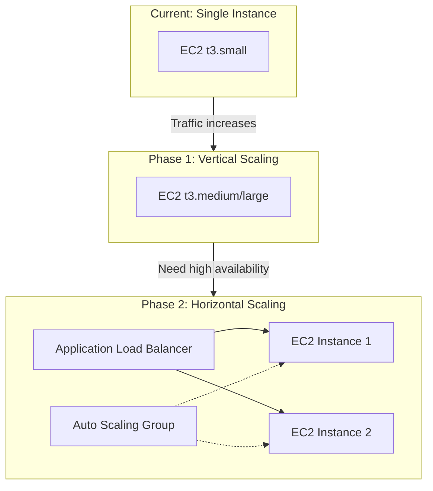
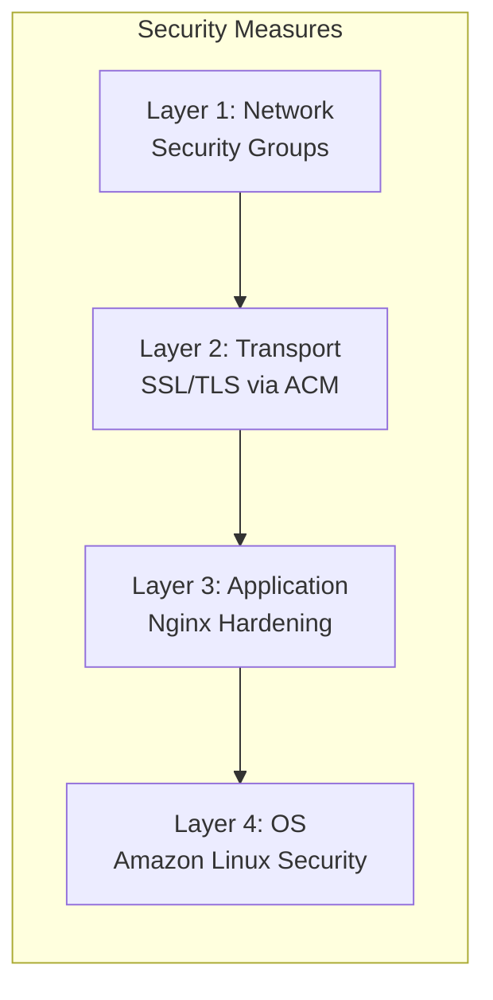
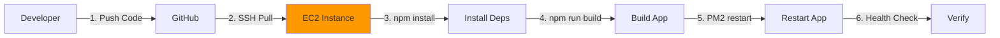

# Solution & Architecture Design Document

## Project: Requirement & Effort Tracker MVP

### Document Information

- **Version**: 1.0
- **Last Updated**: 2026-02-11
- **Cloud Platform**: Amazon Web Services (AWS)
- **Architecture Style**: Simple, Minimal Viable Infrastructure

---

## 1. Overview

### 1.1 Application Description

The Requirement & Effort Tracker is a lightweight, single-page web application built with Next.js 15 that allows users to capture project requirements, assign effort values, and track total effort dynamically. The application is designed to be simple and unauthenticated, with all data stored in the user's browser local storage.

### 1.2 Technology Stack

| Component       | Technology                |
| --------------- | ------------------------- |
| Framework       | Next.js 15.5 (App Router) |
| Language        | TypeScript 5.x            |
| UI Library      | React 19.1                |
| Styling         | Tailwind CSS 4.x          |
| Build Tool      | Turbopack                 |
| Package Manager | npm                       |
| Data Storage    | Browser Local Storage     |
| Runtime         | Node.js 20.x LTS          |

### 1.3 Key Characteristics

- **Stateless Backend**: No server-side data persistence required
- **Client-Side Storage**: All user data stored in browser's localStorage
- **No Authentication**: Public access without login requirements
- **Static-Optimized**: Can leverage Next.js static generation capabilities

---

## 2. Architecture Diagram

### 2.1 High-Level Infrastructure



### 2.2 Application Flow



---

## 3. Infrastructure Components

### 3.1 AWS Services Summary

| Service         | Purpose                | Configuration               |
| --------------- | ---------------------- | --------------------------- |
| EC2             | Application hosting    | t3.small, Amazon Linux 2023 |
| VPC             | Network isolation      | Single VPC, public subnet   |
| Security Groups | Firewall rules         | HTTP/HTTPS/SSH access       |
| Route 53        | DNS management         | A record to EC2 Elastic IP  |
| ACM             | SSL/TLS certificates   | Free public certificate     |
| CloudWatch      | Monitoring and logging | Basic metrics and logs      |
| Elastic IP      | Static public IP       | 1 EIP for EC2               |

### 3.2 EC2 Instance Specification

| Attribute     | Value                        |
| ------------- | ---------------------------- |
| Instance Type | t3.small (2 vCPU, 2 GB RAM)  |
| AMI           | Amazon Linux 2023            |
| Storage       | 20 GB gp3 EBS volume         |
| Elastic IP    | Yes (for static DNS mapping) |
| Key Pair      | SSH key for secure access    |

**Why t3.small?**

- Sufficient for a lightweight Next.js application
- Burstable performance handles traffic spikes
- Cost-effective for MVP (~$15/month)
- Easy to upgrade if needed

---

## 4. Deployment Architecture

### 4.1 Application Deployment Model



### 4.2 Software Stack on EC2

| Layer           | Component      | Purpose                              |
| --------------- | -------------- | ------------------------------------ |
| Web Server      | Nginx          | Reverse proxy, SSL termination       |
| Process Manager | PM2            | Node.js process management, restarts |
| Runtime         | Node.js 20 LTS | JavaScript runtime                   |
| Application     | Next.js 15     | Web application framework            |

### 4.3 Directory Structure on EC2

```
/home/ec2-user/
└── app/
    ├── .next/              # Next.js build output
    ├── node_modules/       # Dependencies
    ├── public/             # Static assets
    ├── src/                # Source code
    ├── package.json        # Project configuration
    └── ecosystem.config.js # PM2 configuration
```

### 4.4 PM2 Configuration

```javascript
// ecosystem.config.js
module.exports = {
  apps: [
    {
      name: "requirement-tracker",
      script: "node_modules/next/dist/bin/next",
      args: "start",
      instances: 1,
      autorestart: true,
      watch: false,
      max_memory_restart: "500M",
      env: {
        NODE_ENV: "production",
        PORT: 3000,
      },
    },
  ],
};
```

---

## 5. Network Architecture

### 5.1 VPC Configuration

| Component        | Configuration                     |
| ---------------- | --------------------------------- |
| VPC CIDR         | 10.0.0.0/16                       |
| Public Subnet    | 10.0.1.0/24 (Availability Zone A) |
| Internet Gateway | Attached to VPC                   |
| Route Table      | 0.0.0.0/0 → Internet Gateway      |

### 5.2 Security Groups

#### Application Security Group (sg-app)

| Type     | Protocol | Port Range | Source     | Description             |
| -------- | -------- | ---------- | ---------- | ----------------------- |
| Inbound  | TCP      | 80         | 0.0.0.0/0  | HTTP access             |
| Inbound  | TCP      | 443        | 0.0.0.0/0  | HTTPS access            |
| Inbound  | TCP      | 22         | Your IP/32 | SSH access (restricted) |
| Outbound | All      | All        | 0.0.0.0/0  | All outbound traffic    |

### 5.3 Network Flow



---

## 6. Scalability Considerations

### 6.1 Current Architecture (MVP)

The current single-instance architecture is designed for simplicity and cost-effectiveness. It can handle:

- **Estimated Capacity**: ~100-500 concurrent users
- **Response Time**: <200ms for static content

### 6.2 Scaling Path (If Needed)



### 6.3 Scaling Recommendations

| Trigger                 | Action                       |
| ----------------------- | ---------------------------- |
| CPU > 80% sustained     | Upgrade to t3.medium         |
| Need 99.9% availability | Add ALB + multiple instances |
| Global users            | Consider CloudFront CDN      |
| >1000 concurrent users  | Implement Auto Scaling Group |

---

## 7. Security

### 7.1 Security Layers



### 7.2 Security Measures

| Category    | Measure                | Implementation                  |
| ----------- | ---------------------- | ------------------------------- |
| Network     | Security Groups        | Restrict inbound to 80, 443, 22 |
| Network     | SSH Access             | Limit to specific IP addresses  |
| Transport   | SSL/TLS                | ACM certificate, HTTPS only     |
| Transport   | HTTP to HTTPS Redirect | Nginx configuration             |
| Application | Security Headers       | X-Frame-Options, CSP, HSTS      |
| OS          | Regular Updates        | Automated security patches      |
| Access      | IAM Role               | Minimal permissions for EC2     |
| Access      | SSH Key Pair           | No password authentication      |

### 7.3 IAM Role for EC2

```json
{
  "Version": "2012-10-17",
  "Statement": [
    {
      "Effect": "Allow",
      "Action": [
        "logs:CreateLogGroup",
        "logs:CreateLogStream",
        "logs:PutLogEvents"
      ],
      "Resource": "arn:aws:logs:*:*:*"
    },
    {
      "Effect": "Allow",
      "Action": ["cloudwatch:PutMetricData"],
      "Resource": "*"
    }
  ]
}
```

### 7.4 Nginx Security Configuration

```nginx
# Security headers
add_header X-Frame-Options "SAMEORIGIN" always;
add_header X-Content-Type-Options "nosniff" always;
add_header X-XSS-Protection "1; mode=block" always;
add_header Strict-Transport-Security "max-age=31536000; includeSubDomains" always;

# Redirect HTTP to HTTPS
server {
    listen 80;
    server_name _;
    return 301 https://$host$request_uri;
}
```

---

## 8. Monitoring & Logging

### 8.1 CloudWatch Metrics

| Metric               | Threshold       | Action                |
| -------------------- | --------------- | --------------------- |
| CPUUtilization       | > 80% for 5 min | Alert via SNS         |
| StatusCheckFailed    | > 0             | Alert + Auto Recovery |
| DiskSpaceUtilization | > 80%           | Alert via SNS         |
| MemoryUtilization    | > 85%           | Alert via SNS         |

### 8.2 Log Management

| Log Type          | Location                  | Retention    |
| ----------------- | ------------------------- | ------------ |
| Application Logs  | /var/log/app/             | 7 days local |
| Nginx Access Logs | /var/log/nginx/access.log | 7 days local |
| Nginx Error Logs  | /var/log/nginx/error.log  | 7 days local |
| System Logs       | CloudWatch Logs           | 30 days      |

### 8.3 CloudWatch Agent Configuration

```json
{
  "logs": {
    "logs_collected": {
      "files": {
        "collect_list": [
          {
            "file_path": "/var/log/nginx/access.log",
            "log_group_name": "/app/nginx/access",
            "log_stream_name": "{instance_id}"
          },
          {
            "file_path": "/var/log/nginx/error.log",
            "log_group_name": "/app/nginx/error",
            "log_stream_name": "{instance_id}"
          }
        ]
      }
    }
  },
  "metrics": {
    "metrics_collected": {
      "mem": {
        "measurement": ["mem_used_percent"]
      },
      "disk": {
        "measurement": ["disk_used_percent"],
        "resources": ["/"]
      }
    }
  }
}
```

### 8.4 Alerting

| Alert             | Condition               | Notification        |
| ----------------- | ----------------------- | ------------------- |
| High CPU          | CPU > 80% for 5 minutes | Email via SNS       |
| Instance Down     | Status check failed     | Email + SMS via SNS |
| Disk Space Low    | Disk > 80% used         | Email via SNS       |
| Application Error | Error rate > 5%         | Email via SNS       |

---

## 9. Deployment Process

### 9.1 Deployment Workflow



### 9.2 Manual Deployment Steps

```bash
# 1. SSH into EC2 instance
ssh -i "your-key.pem" ec2-user@your-ec2-ip

# 2. Navigate to application directory
cd /home/ec2-user/app

# 3. Pull latest code
git pull origin main

# 4. Install dependencies
npm ci --production

# 5. Build the application
npm run build

# 6. Restart the application
pm2 restart requirement-tracker

# 7. Verify deployment
pm2 status
curl -I http://localhost:3000
```

### 9.3 Initial Server Setup Script

```bash
#!/bin/bash
# Initial EC2 setup script

# Update system
sudo dnf update -y

# Install Node.js 20
curl -fsSL https://rpm.nodesource.com/setup_20.x | sudo bash -
sudo dnf install -y nodejs

# Install PM2 globally
sudo npm install -g pm2

# Install Nginx
sudo dnf install -y nginx

# Start and enable Nginx
sudo systemctl start nginx
sudo systemctl enable nginx

# Configure PM2 to start on boot
pm2 startup systemd -u ec2-user --hp /home/ec2-user
```

### 9.4 Nginx Configuration

```nginx
# /etc/nginx/conf.d/app.conf
server {
    listen 443 ssl http2;
    server_name your-domain.com;

    ssl_certificate /etc/letsencrypt/live/your-domain.com/fullchain.pem;
    ssl_certificate_key /etc/letsencrypt/live/your-domain.com/privkey.pem;

    location / {
        proxy_pass http://127.0.0.1:3000;
        proxy_http_version 1.1;
        proxy_set_header Upgrade $http_upgrade;
        proxy_set_header Connection 'upgrade';
        proxy_set_header Host $host;
        proxy_set_header X-Real-IP $remote_addr;
        proxy_set_header X-Forwarded-For $proxy_add_x_forwarded_for;
        proxy_set_header X-Forwarded-Proto $scheme;
        proxy_cache_bypass $http_upgrade;
    }
}
```

---

## 10. Cost Estimation

### 10.1 Monthly Cost Breakdown (US East - N. Virginia)

| Service               | Configuration                | Monthly Cost (USD) |
| --------------------- | ---------------------------- | ------------------ |
| EC2 Instance          | t3.small, On-Demand          | ~$15.18            |
| EBS Storage           | 20 GB gp3                    | ~$1.60             |
| Elastic IP            | 1 EIP (attached to instance) | $0.00\*            |
| Data Transfer         | 10 GB outbound (estimated)   | ~$0.90             |
| Route 53              | 1 hosted zone + queries      | ~$0.50             |
| CloudWatch            | Basic metrics + 5 GB logs    | ~$2.50             |
| **Total (Estimated)** |                              | **~$20.68/month**  |

\*Elastic IP is free when attached to a running instance

### 10.2 Cost Optimization Options

| Option                     | Savings        | Trade-off                            |
| -------------------------- | -------------- | ------------------------------------ |
| Reserved Instance (1 year) | ~30% (~$10/mo) | Upfront commitment                   |
| Reserved Instance (3 year) | ~50% (~$7/mo)  | Longer commitment                    |
| Spot Instance              | ~70% (~$5/mo)  | Can be interrupted (not recommended) |
| t3.micro (if sufficient)   | ~50% (~$8/mo)  | Less CPU/memory                      |

### 10.3 Annual Cost Projection

| Scenario                 | Monthly Cost | Annual Cost |
| ------------------------ | ------------ | ----------- |
| On-Demand (current)      | $20.68       | $248.16     |
| With 1-Year Reserved EC2 | $14.50       | $174.00     |
| With 3-Year Reserved EC2 | $11.00       | $132.00     |

### 10.4 Cost Monitoring

- Set up AWS Budgets alert at $25/month
- Review Cost Explorer monthly
- Enable cost allocation tags for tracking

---

## 11. Summary

### 11.1 Architecture Highlights

| Aspect      | Decision                                       |
| ----------- | ---------------------------------------------- |
| Simplicity  | Single EC2 instance, minimal AWS services      |
| Cost        | ~$21/month for production-ready infrastructure |
| Scalability | Clear upgrade path when needed                 |
| Security    | Multi-layer security with SSL, security groups |
| Monitoring  | CloudWatch for metrics, logs, and alerts       |
| Deployment  | Simple manual deployment via SSH               |

### 11.2 Architecture Decision Records

| Decision                  | Rationale                                        |
| ------------------------- | ------------------------------------------------ |
| Single EC2 vs. ECS/Lambda | Simpler for MVP, lower learning curve            |
| t3.small vs. t3.micro     | Better performance headroom for Next.js          |
| Nginx vs. direct exposure | SSL termination, security headers, reverse proxy |
| PM2 vs. systemd           | Better Node.js process management, zero-downtime |
| Manual vs. CI/CD          | Simpler for MVP, can add CI/CD later             |
| Public subnet only        | No backend services requiring private subnet     |

### 11.3 Future Enhancements (When Needed)

1. **CI/CD Pipeline**: GitHub Actions for automated deployments
2. **CDN**: CloudFront for global content delivery
3. **High Availability**: ALB + Auto Scaling Group
4. **Containerization**: Docker + ECS for easier scaling
5. **Infrastructure as Code**: Terraform or CloudFormation

---

_End of Document_
