# Technical Specification Document

## Project: Requirement & Effort Tracker MVP

### Document Information

- **Version**: 1.0
- **Last Updated**: 2026-02-11
- **Status**: Draft
- **Related Documents**:
  - [Functional Requirements](./requirement.md)
  - [Data Schema](./data-schema.md)
  - [Architecture](./architecture.md)

---

## Table of Contents

1. [Project Overview](#1-project-overview)
2. [Project Structure](#2-project-structure)
3. [API Specifications](#3-api-specifications)
4. [Business Logic & Sequence Diagrams](#4-business-logic--sequence-diagrams)
5. [Data Schema](#5-data-schema)
6. [Architecture Diagram](#6-architecture-diagram)
7. [Integration Contracts](#7-integration-contracts)
8. [Development Guidelines](#8-development-guidelines)

---

## 1. Project Overview

### 1.1 Project Summary

The Requirement & Effort Tracker is a lightweight, browser-based web application that enables users to:

- Create and manage project requirements
- Assign effort values to each requirement
- Toggle requirements between active/inactive status
- Track total effort of active requirements in real-time
- Export/Import project data as JSON files

**Key Characteristics:**

- **No Authentication**: Open access without login requirements
- **Client-Side Only**: All data stored in browser's localStorage
- **Single-Project Mode**: One project at a time per browser
- **Auto-Save**: All changes automatically persisted

### 1.2 Technology Stack

| Category            | Technology           | Version | Purpose                         |
| ------------------- | -------------------- | ------- | ------------------------------- |
| **Framework**       | Next.js              | 15.5.x  | React framework with App Router |
| **UI Library**      | React                | 19.1.x  | Component-based UI              |
| **Language**        | TypeScript           | 5.x     | Type-safe JavaScript            |
| **Styling**         | Tailwind CSS         | 4.x     | Utility-first CSS               |
| **Build Tool**      | Turbopack            | -       | Fast bundler for Next.js        |
| **Icons**           | Font Awesome         | 6.4.0   | Icon library                    |
| **Fonts**           | Inter (Google Fonts) | -       | Primary typeface                |
| **Data Storage**    | localStorage API     | -       | Browser-based persistence       |
| **Package Manager** | npm                  | -       | Dependency management           |

### 1.3 Development Environment Setup

#### Prerequisites

- Node.js 20.x LTS or higher
- npm 10.x or higher
- Git 2.x or higher
- VS Code (recommended) with extensions:
  - ESLint
  - Prettier
  - Tailwind CSS IntelliSense
  - TypeScript and JavaScript Language Features

#### Installation Steps

```bash
# 1. Clone the repository
git clone <repository-url>
cd web-starter-kit

# 2. Install dependencies
npm install

# 3. Start development server
npm run dev

# 4. Open in browser
# Navigate to http://localhost:3000
```

#### Available Scripts

| Script  | Command         | Description                     |
| ------- | --------------- | ------------------------------- |
| `dev`   | `npm run dev`   | Start dev server with Turbopack |
| `build` | `npm run build` | Create production build         |
| `start` | `npm run start` | Start production server         |
| `lint`  | `npm run lint`  | Run ESLint for code quality     |

#### Environment Configuration

No environment variables are required for basic operation. The application runs entirely client-side.

For production deployment, see [Architecture Document](./architecture.md).

---

## 2. Project Structure

### 2.1 Directory Overview

```
web-starter-kit/
├── docs/                          # Documentation
│   ├── requirement.md             # Functional requirements
│   ├── data-schema.md             # Data schema design
│   ├── architecture.md            # AWS architecture
│   └── technical-spec.md          # This document
├── public/                        # Static assets
│   ├── favicon.ico                # App favicon
│   └── *.svg                      # Static images
├── src/                           # Source code
│   └── app/                       # Next.js App Router
│       ├── layout.tsx             # Root layout
│       ├── page.tsx               # Home page (entry point)
│       └── globals.css            # Global styles
├── tests/                         # Test files
├── ui-prototype/                  # UI/UX team prototypes (reference)
│   ├── project-setup.html         # Project setup screen
│   └── dashboard.html             # Dashboard screen
├── .eslintrc.json                 # ESLint configuration
├── next.config.ts                 # Next.js configuration
├── package.json                   # Dependencies & scripts
├── postcss.config.mjs             # PostCSS configuration
├── tailwind.config.ts             # Tailwind CSS configuration
└── tsconfig.json                  # TypeScript configuration
```

### 2.2 Recommended Implementation Structure

The following structure is recommended for implementing the application:

```
src/
├── app/                           # Next.js App Router pages
│   ├── layout.tsx                 # Root layout (metadata, fonts)
│   ├── page.tsx                   # Entry point → redirects based on state
│   ├── setup/
│   │   └── page.tsx               # Project Setup screen (SCR-01)
│   └── dashboard/
│       └── page.tsx               # Dashboard screen (SCR-02)
├── components/                    # React components
│   ├── ui/                        # Reusable UI components
│   │   ├── Button.tsx
│   │   ├── Input.tsx
│   │   ├── Modal.tsx
│   │   ├── Toggle.tsx
│   │   └── Card.tsx
│   ├── layout/                    # Layout components
│   │   ├── Header.tsx
│   │   └── Sidebar.tsx
│   ├── project/                   # Project-related components
│   │   ├── ProjectNameInput.tsx
│   │   └── ProjectNameDisplay.tsx
│   └── requirements/              # Requirements-related components
│       ├── RequirementsList.tsx
│       ├── RequirementRow.tsx
│       ├── RequirementForm.tsx
│       ├── EffortSummary.tsx
│       └── EmptyState.tsx
├── hooks/                         # Custom React hooks
│   ├── useLocalStorage.ts         # localStorage abstraction
│   ├── useProject.ts              # Project state management
│   └── useRequirements.ts         # Requirements state management
├── lib/                           # Utility libraries
│   ├── storage.ts                 # localStorage service
│   ├── validation.ts              # Validation utilities
│   └── format.ts                  # Formatting utilities
└── types/                         # TypeScript type definitions
    └── index.ts                   # Shared types and interfaces
```

### 2.3 Module Responsibilities

| Module                     | Responsibility                                     |
| -------------------------- | -------------------------------------------------- |
| `app/`                     | Route definitions, page components, metadata       |
| `components/ui/`           | Reusable, stateless UI primitives                  |
| `components/layout/`       | Layout structure (header, sidebar, main content)   |
| `components/project/`      | Project-specific UI (name display, edit)           |
| `components/requirements/` | Requirements CRUD UI components                    |
| `hooks/`                   | State management, side effects, localStorage sync  |
| `lib/`                     | Pure functions for storage, validation, formatting |
| `types/`                   | Shared TypeScript interfaces, types, constants     |

### 2.4 Separation of Concerns

```
┌─────────────────────────────────────────────────────────────────────────┐
│                           PRESENTATION LAYER                             │
│  ┌─────────────────┐  ┌─────────────────┐  ┌─────────────────────────┐  │
│  │   Pages (app/)   │  │   Components    │  │     UI Components       │  │
│  │  - Setup Page    │  │  - Header       │  │  - Button, Input        │  │
│  │  - Dashboard     │  │  - Sidebar      │  │  - Modal, Toggle        │  │
│  └────────┬─────────┘  └────────┬────────┘  └───────────┬─────────────┘  │
│           │                     │                        │               │
└───────────┼─────────────────────┼────────────────────────┼───────────────┘
            │                     │                        │
            ▼                     ▼                        ▼
┌─────────────────────────────────────────────────────────────────────────┐
│                            STATE LAYER                                   │
│  ┌─────────────────────────────────────────────────────────────────┐    │
│  │                      Custom Hooks (hooks/)                       │    │
│  │  - useProject: Project state + CRUD                              │    │
│  │  - useRequirements: Requirements state + CRUD                    │    │
│  │  - useLocalStorage: Generic localStorage hook                    │    │
│  └────────────────────────────────────┬────────────────────────────┘    │
│                                       │                                  │
└───────────────────────────────────────┼──────────────────────────────────┘
                                        │
                                        ▼
┌─────────────────────────────────────────────────────────────────────────┐
│                           SERVICE LAYER                                  │
│  ┌───────────────────┐  ┌───────────────────┐  ┌───────────────────┐    │
│  │   storage.ts      │  │   validation.ts   │  │    format.ts      │    │
│  │  - CRUD ops       │  │  - validateName   │  │  - formatEffort   │    │
│  │  - localStorage   │  │  - validateDesc   │  │  - formatDate     │    │
│  └─────────┬─────────┘  │  - validateEffort │  └───────────────────┘    │
│            │            └───────────────────┘                            │
└────────────┼────────────────────────────────────────────────────────────┘
             │
             ▼
┌─────────────────────────────────────────────────────────────────────────┐
│                        BROWSER STORAGE                                   │
│  ┌─────────────────────────────────────────────────────────────────┐    │
│  │                     localStorage API                             │    │
│  │  Keys: ret_project, ret_requirements, ret_preferences,           │    │
│  │        ret_schema_version                                        │    │
│  └─────────────────────────────────────────────────────────────────┘    │
└─────────────────────────────────────────────────────────────────────────┘
```

---

## 3. API Specifications

### 3.1 Overview

This application is **client-side only** with no backend API. All data operations are performed through the browser's localStorage API. This section documents the localStorage interface as the "API" for this application.

### 3.2 Storage Keys

| Key                  | Data Type     | Description                   |
| -------------------- | ------------- | ----------------------------- |
| `ret_project`        | JSON (Object) | Project metadata and settings |
| `ret_requirements`   | JSON (Array)  | Array of requirement objects  |
| `ret_preferences`    | JSON (Object) | User display preferences      |
| `ret_schema_version` | JSON (Number) | Schema version for migrations |

### 3.3 Storage Service Interface

```typescript
// lib/storage.ts

/**
 * Storage Service - Abstracts localStorage operations
 * All methods are synchronous as localStorage is synchronous
 */

// Constants
export const STORAGE_KEYS = {
  PROJECT: "ret_project",
  REQUIREMENTS: "ret_requirements",
  PREFERENCES: "ret_preferences",
  SCHEMA_VERSION: "ret_schema_version",
} as const;

// Read Operations
function getProject(): Project | null;
function getRequirements(): Requirement[];
function getPreferences(): UserPreferences;
function getSchemaVersion(): number;

// Write Operations
function saveProject(project: Project): void;
function saveRequirements(requirements: Requirement[]): void;
function savePreferences(preferences: UserPreferences): void;
function saveSchemaVersion(version: number): void;

// Delete Operations
function clearAllData(): void;
function clearProject(): void;

// Utility Operations
function hasExistingProject(): boolean;
function initializeNewProject(name: string): void;
```

### 3.4 Data Access Patterns

#### Pattern 1: Check for Existing Project (App Entry)

```typescript
// Used in app/page.tsx to determine routing
const hasProject = storageService.hasExistingProject();
if (hasProject) {
  redirect("/dashboard");
} else {
  redirect("/setup");
}
```

#### Pattern 2: Create New Project

```typescript
// Used in Setup page
function createProject(name: string): void {
  const project: Project = {
    name: name.trim(),
    createdAt: new Date().toISOString(),
    updatedAt: new Date().toISOString(),
    nextRequirementId: 1,
  };
  storageService.saveProject(project);
  storageService.saveRequirements([]);
  storageService.savePreferences({ showEffortColumn: true });
  storageService.saveSchemaVersion(1);
}
```

#### Pattern 3: Add Requirement

```typescript
// Used in Dashboard - Add Requirement form
function addRequirement(description: string, effort: number): Requirement {
  const project = storageService.getProject()!;
  const requirements = storageService.getRequirements();

  const newRequirement: Requirement = {
    id: project.nextRequirementId,
    description: description.trim(),
    effort: Math.round(effort * 100) / 100,
    isActive: true,
    createdAt: new Date().toISOString(),
  };

  // Update project's next ID
  project.nextRequirementId++;
  project.updatedAt = new Date().toISOString();

  // Save both
  storageService.saveProject(project);
  storageService.saveRequirements([...requirements, newRequirement]);

  return newRequirement;
}
```

#### Pattern 4: Update Requirement

```typescript
function updateRequirement(
  id: number,
  updates: Partial<Pick<Requirement, "description" | "effort" | "isActive">>,
): void {
  const requirements = storageService.getRequirements();
  const index = requirements.findIndex((r) => r.id === id);

  if (index !== -1) {
    requirements[index] = { ...requirements[index], ...updates };
    storageService.saveRequirements(requirements);

    // Update project timestamp
    const project = storageService.getProject()!;
    project.updatedAt = new Date().toISOString();
    storageService.saveProject(project);
  }
}
```

#### Pattern 5: Delete Requirement

```typescript
function deleteRequirement(id: number): void {
  const requirements = storageService.getRequirements();
  const filtered = requirements.filter((r) => r.id !== id);
  storageService.saveRequirements(filtered);

  // Note: nextRequirementId is NOT decremented (per BR.2)
}
```

#### Pattern 6: Toggle Requirement Status

```typescript
function toggleRequirementStatus(id: number): void {
  const requirements = storageService.getRequirements();
  const requirement = requirements.find((r) => r.id === id);

  if (requirement) {
    requirement.isActive = !requirement.isActive;
    storageService.saveRequirements(requirements);
  }
}
```

#### Pattern 7: Export Data

```typescript
interface ExportData {
  projectName: string;
  requirements: Requirement[];
  exportDate: string;
}

function exportData(): ExportData {
  const project = storageService.getProject()!;
  const requirements = storageService.getRequirements();

  return {
    projectName: project.name,
    requirements: requirements,
    exportDate: new Date().toISOString(),
  };
}
```

#### Pattern 8: Import Data

```typescript
function importData(data: ExportData): boolean {
  try {
    // Validate structure
    if (!data.projectName || !Array.isArray(data.requirements)) {
      return false;
    }

    // Create project from import
    const project: Project = {
      name: data.projectName,
      createdAt: new Date().toISOString(),
      updatedAt: new Date().toISOString(),
      nextRequirementId: Math.max(...data.requirements.map((r) => r.id), 0) + 1,
    };

    storageService.saveProject(project);
    storageService.saveRequirements(data.requirements);

    return true;
  } catch {
    return false;
  }
}
```

### 3.5 Error Handling

| Error Type           | Cause                    | Handling                          |
| -------------------- | ------------------------ | --------------------------------- |
| `QuotaExceededError` | localStorage full (~5MB) | Show user-friendly error message  |
| `JSON.parse` error   | Corrupted data           | Offer to reset application        |
| `null` from getItem  | Key doesn't exist        | Return default/null appropriately |

```typescript
function safeGetItem<T>(key: string, defaultValue: T): T {
  try {
    const item = localStorage.getItem(key);
    return item ? JSON.parse(item) : defaultValue;
  } catch {
    console.error(`Error reading ${key} from localStorage`);
    return defaultValue;
  }
}

function safeSetItem(key: string, value: unknown): boolean {
  try {
    localStorage.setItem(key, JSON.stringify(value));
    return true;
  } catch (error) {
    if (error instanceof DOMException && error.name === "QuotaExceededError") {
      console.error("localStorage quota exceeded");
    }
    return false;
  }
}
```

---

## 4. Business Logic & Sequence Diagrams

### 4.1 Application Entry Flow

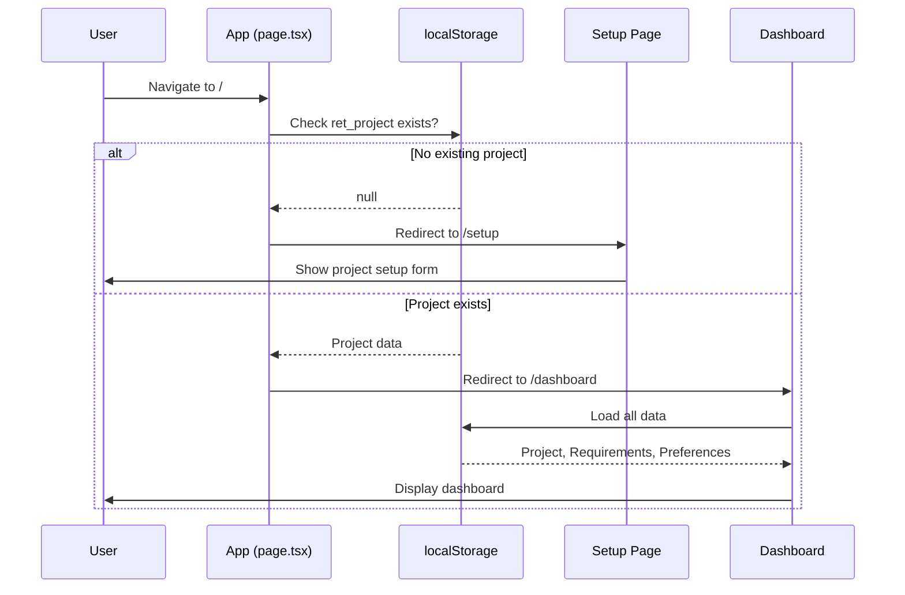

### 4.2 Create Project Flow

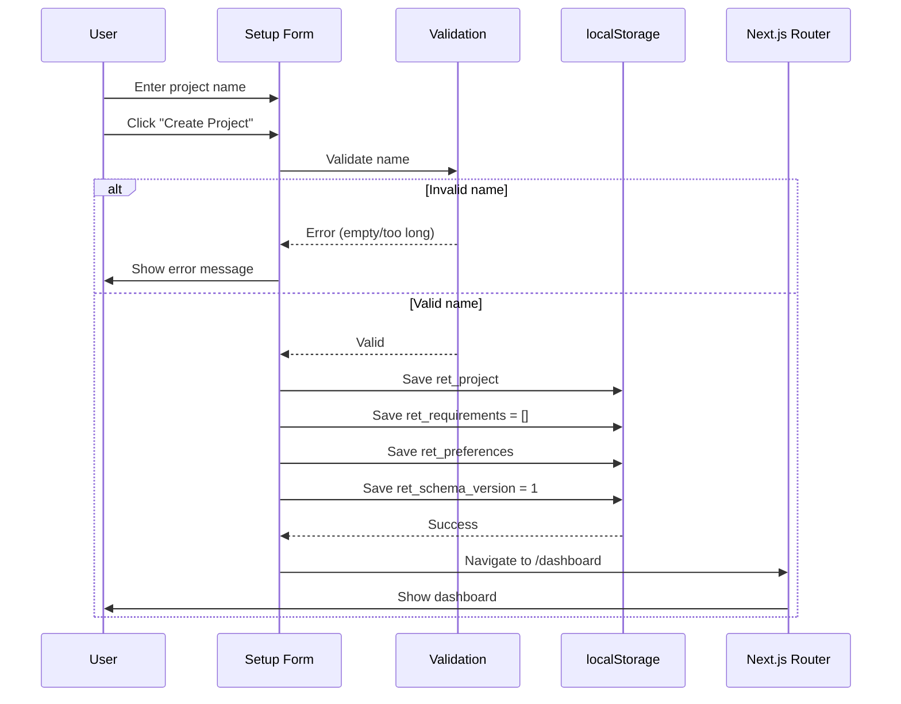

### 4.3 Add Requirement Flow

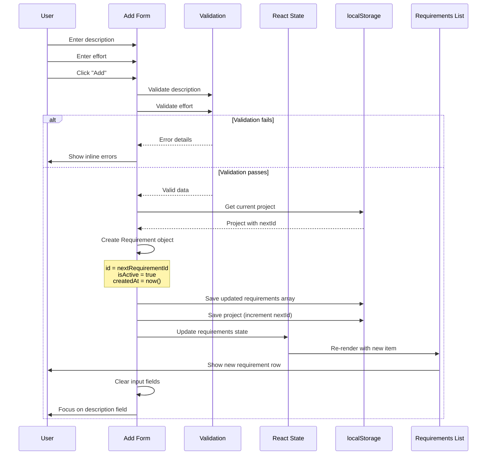

### 4.4 Edit Requirement Flow

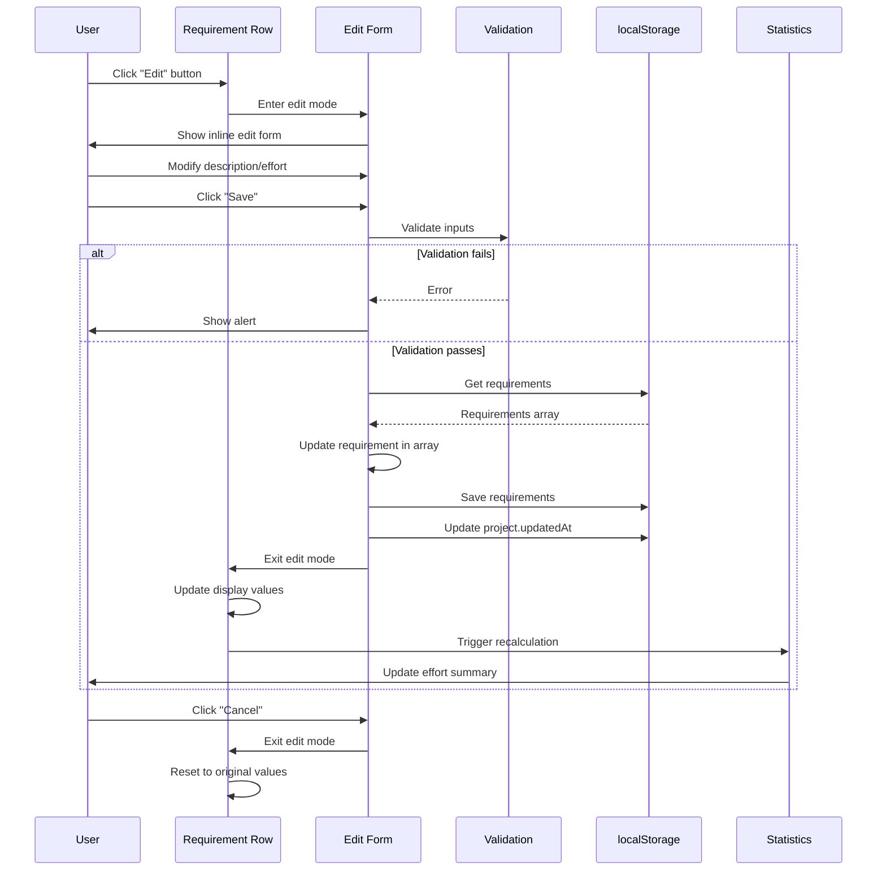

### 4.5 Delete Requirement Flow

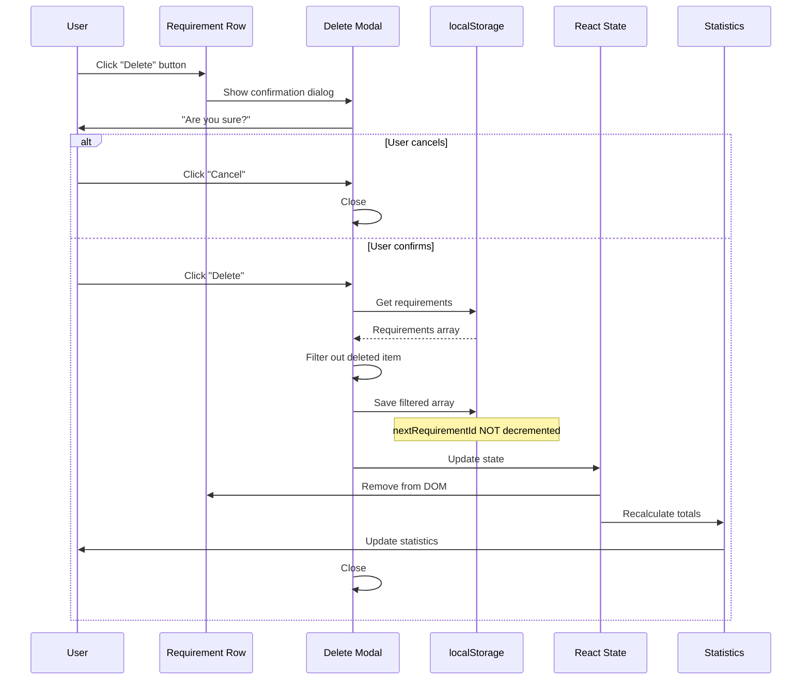

### 4.6 Toggle Status Flow

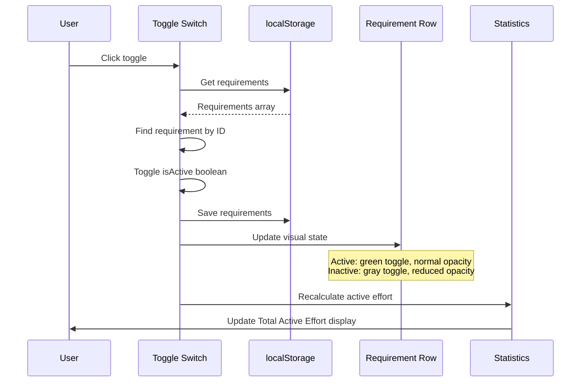

### 4.7 Export Data Flow

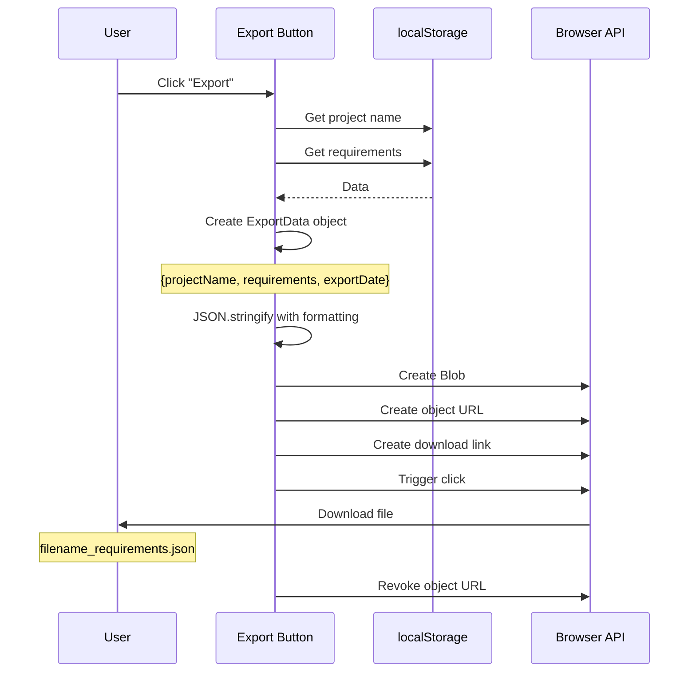

### 4.8 Import Data Flow

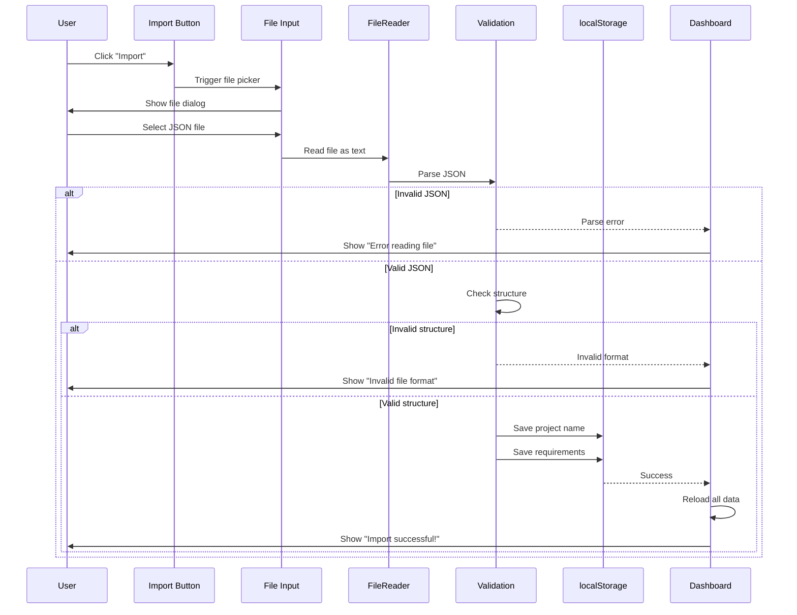

### 4.9 New Project (Reset) Flow

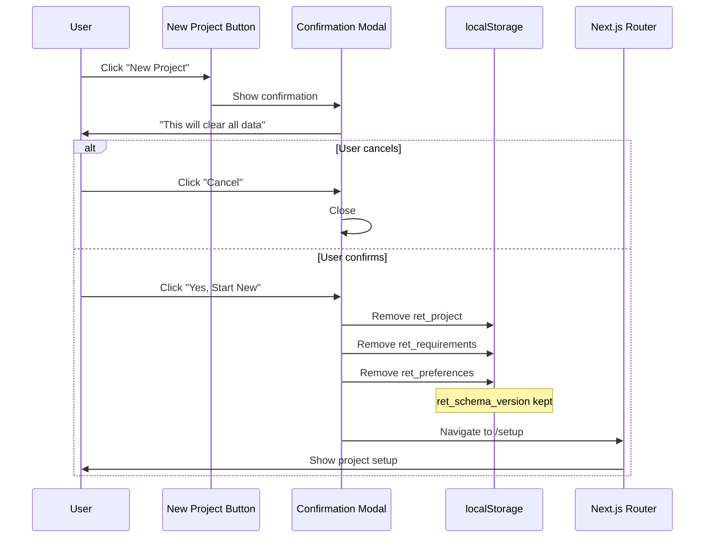

### 4.10 Validation Rules Summary

| Field        | Rule                 | Error Message                               |
| ------------ | -------------------- | ------------------------------------------- |
| Project Name | Required             | "Project name is required"                  |
| Project Name | Max 100 characters   | "Project name cannot exceed 100 characters" |
| Project Name | Not whitespace-only  | "Project name cannot be empty"              |
| Description  | Required             | "Requirement description is required"       |
| Description  | Max 500 characters   | "Description cannot exceed 500 characters"  |
| Description  | Not whitespace-only  | "Requirement description cannot be empty"   |
| Effort       | Required             | "Effort value is required"                  |
| Effort       | Must be number       | "Effort must be a number"                   |
| Effort       | Greater than 0       | "Effort must be greater than zero"          |
| Effort       | Max 9999             | "Effort cannot exceed 9999"                 |
| Effort       | Max 2 decimal places | "Effort can have at most 2 decimal places"  |

### 4.11 Business Constraints

| ID   | Constraint                                                               |
| ---- | ------------------------------------------------------------------------ |
| BR.1 | Only active requirements are included in Total Active Effort calculation |
| BR.2 | Requirement IDs are sequential and never reused after deletion           |
| BR.3 | All data modifications are auto-saved immediately                        |
| BR.4 | Single-project mode: only one project exists at a time                   |
| BR.5 | New project creation requires confirmation and clears all existing data  |
| BR.6 | New requirements default to Active status                                |
| BR.7 | Validation errors prevent form submission                                |

---

## 5. Data Schema

### 5.1 Entity Relationship Diagram

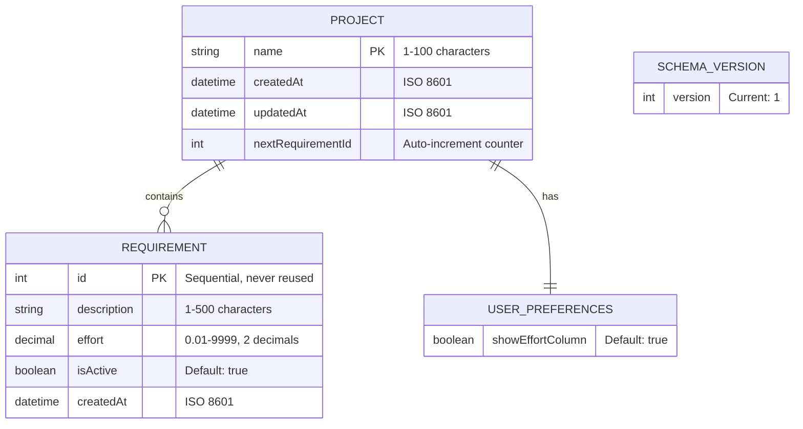

### 5.2 Data Models

#### Project Entity

| Field               | Type   | Constraints          | Default | Description                 |
| ------------------- | ------ | -------------------- | ------- | --------------------------- |
| `name`              | string | 1-100 chars, trimmed | -       | Project name                |
| `createdAt`         | string | ISO 8601 datetime    | now()   | Creation timestamp          |
| `updatedAt`         | string | ISO 8601 datetime    | now()   | Last modification timestamp |
| `nextRequirementId` | number | >= 1                 | 1       | Next ID to assign           |

#### Requirement Entity

| Field         | Type    | Constraints               | Default | Description             |
| ------------- | ------- | ------------------------- | ------- | ----------------------- |
| `id`          | number  | Unique, sequential        | -       | Auto-assigned ID        |
| `description` | string  | 1-500 chars, trimmed      | -       | Requirement description |
| `effort`      | number  | 0.01-9999, 2 decimals max | -       | Effort in days          |
| `isActive`    | boolean | -                         | true    | Active/Inactive status  |
| `createdAt`   | string  | ISO 8601 datetime         | now()   | Creation timestamp      |

#### UserPreferences Entity

| Field              | Type    | Constraints | Default | Description             |
| ------------------ | ------- | ----------- | ------- | ----------------------- |
| `showEffortColumn` | boolean | -           | true    | Show/hide effort column |

### 5.3 Computed Values (Not Stored)

| Value               | Formula                                                                      | Used In        |
| ------------------- | ---------------------------------------------------------------------------- | -------------- |
| Total Requirements  | `requirements.length`                                                        | Statistics     |
| Active Count        | `requirements.filter(r => r.isActive).length`                                | Statistics     |
| Inactive Count      | `requirements.filter(r => !r.isActive).length`                               | Statistics     |
| Total Active Effort | `requirements.filter(r => r.isActive).reduce((sum, r) => sum + r.effort, 0)` | Effort Summary |

### 5.4 Storage Schema

```json
// ret_project
{
  "name": "Project Alpha",
  "createdAt": "2026-02-11T10:30:00.000Z",
  "updatedAt": "2026-02-11T14:45:00.000Z",
  "nextRequirementId": 5
}

// ret_requirements
[
  {
    "id": 1,
    "description": "User authentication module",
    "effort": 5.5,
    "isActive": true,
    "createdAt": "2026-02-11T10:31:00.000Z"
  },
  {
    "id": 2,
    "description": "Dashboard UI",
    "effort": 3.0,
    "isActive": false,
    "createdAt": "2026-02-11T10:32:00.000Z"
  }
]

// ret_preferences
{
  "showEffortColumn": true
}

// ret_schema_version
1
```

---

## 6. Architecture Diagram

### 6.1 High-Level Client Architecture

```mermaid
flowchart TB
    subgraph Browser["Browser Environment"]
        subgraph NextJS["Next.js Application"]
            subgraph Pages["Pages (App Router)"]
                Root["/ (page.tsx)<br/>Entry Point"]
                Setup["/setup (page.tsx)<br/>Project Setup"]
                Dashboard["/dashboard (page.tsx)<br/>Main Dashboard"]
            end

            subgraph Components["React Components"]
                UI["UI Components<br/>Button, Input, Modal, Toggle"]
                Layout["Layout Components<br/>Header, Sidebar"]
                Feature["Feature Components<br/>RequirementsList, EffortSummary"]
            end

            subgraph Hooks["Custom Hooks"]
                UseProject["useProject()"]
                UseRequirements["useRequirements()"]
                UseLocalStorage["useLocalStorage()"]
            end

            subgraph Lib["Library Functions"]
                Storage["storage.ts<br/>CRUD Operations"]
                Validation["validation.ts<br/>Input Validation"]
                Format["format.ts<br/>Data Formatting"]
            end
        end

        subgraph BrowserAPI["Browser APIs"]
            LocalStorage["localStorage<br/>Persistent Storage"]
            FileAPI["File API<br/>Import/Export"]
        end
    end

    Root --> |"No project"| Setup
    Root --> |"Has project"| Dashboard

    Pages --> Components
    Components --> Hooks
    Hooks --> Lib
    Lib --> BrowserAPI
```

### 6.2 Data Flow Diagram

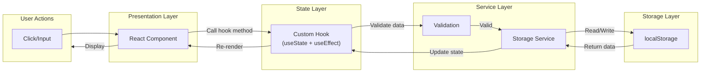

### 6.3 Component Architecture

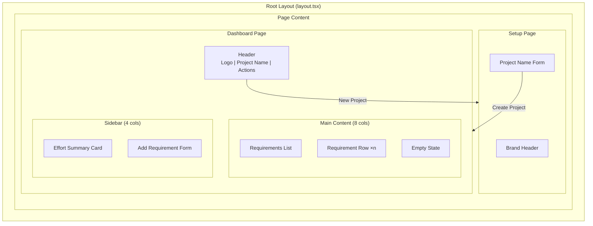

### 6.4 State Management Pattern

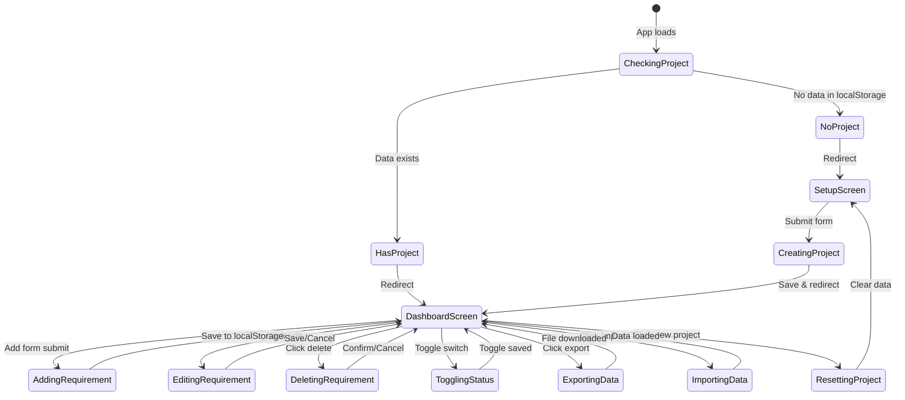

---

## 7. Integration Contracts

### 7.1 TypeScript Interfaces

```typescript
// types/index.ts

/**
 * Project entity - stored in ret_project
 */
export interface Project {
  name: string;
  createdAt: string; // ISO 8601
  updatedAt: string; // ISO 8601
  nextRequirementId: number;
}

/**
 * Requirement entity - stored in ret_requirements array
 */
export interface Requirement {
  id: number;
  description: string;
  effort: number;
  isActive: boolean;
  createdAt: string; // ISO 8601
}

/**
 * User preferences - stored in ret_preferences
 */
export interface UserPreferences {
  showEffortColumn: boolean;
}

/**
 * Export/Import data format
 */
export interface ExportData {
  projectName: string;
  requirements: Requirement[];
  exportDate: string; // ISO 8601
}

/**
 * Validation result
 */
export interface ValidationResult {
  isValid: boolean;
  error?: string;
}

/**
 * Statistics computed from requirements
 */
export interface RequirementStats {
  total: number;
  active: number;
  inactive: number;
  totalActiveEffort: number;
}
```

### 7.2 Shared Constants

```typescript
// lib/constants.ts

/**
 * localStorage key names
 */
export const STORAGE_KEYS = {
  PROJECT: "ret_project",
  REQUIREMENTS: "ret_requirements",
  PREFERENCES: "ret_preferences",
  SCHEMA_VERSION: "ret_schema_version",
} as const;

/**
 * Validation constraints
 */
export const CONSTRAINTS = {
  PROJECT_NAME: {
    MIN_LENGTH: 1,
    MAX_LENGTH: 100,
  },
  DESCRIPTION: {
    MIN_LENGTH: 1,
    MAX_LENGTH: 500,
  },
  EFFORT: {
    MIN: 0.01,
    MAX: 9999,
    DECIMAL_PLACES: 2,
  },
} as const;

/**
 * Default values
 */
export const DEFAULTS = {
  SHOW_EFFORT_COLUMN: true,
  SCHEMA_VERSION: 1,
  NEXT_REQUIREMENT_ID: 1,
  IS_ACTIVE: true,
} as const;

/**
 * Route paths
 */
export const ROUTES = {
  HOME: "/",
  SETUP: "/setup",
  DASHBOARD: "/dashboard",
} as const;
```

### 7.3 Hook Contracts

```typescript
// hooks/useProject.ts
export interface UseProjectReturn {
  project: Project | null;
  isLoading: boolean;
  createProject: (name: string) => ValidationResult;
  updateProjectName: (name: string) => ValidationResult;
  clearProject: () => void;
  hasProject: () => boolean;
}

// hooks/useRequirements.ts
export interface UseRequirementsReturn {
  requirements: Requirement[];
  isLoading: boolean;
  stats: RequirementStats;
  addRequirement: (description: string, effort: number) => ValidationResult;
  updateRequirement: (
    id: number,
    updates: Partial<Pick<Requirement, "description" | "effort">>,
  ) => ValidationResult;
  deleteRequirement: (id: number) => void;
  toggleStatus: (id: number) => void;
  exportData: () => ExportData;
  importData: (data: ExportData) => ValidationResult;
}

// hooks/useLocalStorage.ts
export interface UseLocalStorageReturn<T> {
  value: T;
  setValue: (value: T) => boolean;
  removeValue: () => void;
}
```

### 7.4 Component Props Interfaces

```typescript
// components/ui/Button.tsx
export interface ButtonProps {
  children: React.ReactNode;
  variant?: "primary" | "secondary" | "danger" | "ghost";
  size?: "sm" | "md" | "lg";
  disabled?: boolean;
  onClick?: () => void;
  type?: "button" | "submit";
  className?: string;
}

// components/ui/Input.tsx
export interface InputProps {
  value: string;
  onChange: (value: string) => void;
  placeholder?: string;
  maxLength?: number;
  error?: string;
  disabled?: boolean;
  type?: "text" | "number";
  className?: string;
}

// components/ui/Modal.tsx
export interface ModalProps {
  isOpen: boolean;
  onClose: () => void;
  title: string;
  children: React.ReactNode;
  actions?: React.ReactNode;
}

// components/ui/Toggle.tsx
export interface ToggleProps {
  checked: boolean;
  onChange: (checked: boolean) => void;
  disabled?: boolean;
  label?: string;
}

// components/requirements/RequirementRow.tsx
export interface RequirementRowProps {
  requirement: Requirement;
  onEdit: (id: number, description: string, effort: number) => void;
  onDelete: (id: number) => void;
  onToggle: (id: number) => void;
  isEditing: boolean;
  onStartEdit: () => void;
  onCancelEdit: () => void;
}

// components/requirements/EffortSummary.tsx
export interface EffortSummaryProps {
  stats: RequirementStats;
}

// components/requirements/RequirementForm.tsx
export interface RequirementFormProps {
  onSubmit: (description: string, effort: number) => ValidationResult;
}
```

### 7.5 Service Contracts

```typescript
// lib/storage.ts
export interface StorageService {
  // Project
  getProject(): Project | null;
  saveProject(project: Project): boolean;
  hasExistingProject(): boolean;

  // Requirements
  getRequirements(): Requirement[];
  saveRequirements(requirements: Requirement[]): boolean;

  // Preferences
  getPreferences(): UserPreferences;
  savePreferences(preferences: UserPreferences): boolean;

  // Schema
  getSchemaVersion(): number;
  saveSchemaVersion(version: number): boolean;

  // Utility
  clearAllData(): void;
}

// lib/validation.ts
export interface ValidationService {
  validateProjectName(name: string): ValidationResult;
  validateDescription(description: string): ValidationResult;
  validateEffort(effort: number | string): ValidationResult;
  validateImportData(data: unknown): ValidationResult;
}
```

---

## 8. Development Guidelines

### 8.1 Coding Standards

#### TypeScript

- **Strict mode**: Enable `strict: true` in tsconfig.json
- **Explicit types**: Always define return types for functions
- **No `any`**: Avoid using `any`; use `unknown` for truly unknown types
- **Prefer `const`**: Use `const` over `let` when variable won't be reassigned
- **Interface over Type**: Prefer `interface` for object shapes, `type` for unions/intersections

```typescript
// ✅ Good
function calculateTotal(requirements: Requirement[]): number {
  return requirements.reduce((sum, r) => sum + r.effort, 0);
}

// ❌ Bad
function calculateTotal(requirements: any) {
  return requirements.reduce((sum: any, r: any) => sum + r.effort, 0);
}
```

#### React

- **Functional components only**: No class components
- **Named exports**: Prefer named exports over default exports
- **Props destructuring**: Destructure props in function parameters
- **Hooks at top**: Call hooks at the top level of components

```typescript
// ✅ Good
export function RequirementRow({ requirement, onEdit }: RequirementRowProps) {
  const [isEditing, setIsEditing] = useState(false);
  // ...
}

// ❌ Bad
export default class RequirementRow extends Component { ... }
```

#### Tailwind CSS

- **Utility classes**: Use Tailwind utilities, avoid custom CSS
- **Consistent spacing**: Use Tailwind's spacing scale (p-4, m-2, gap-4)
- **Responsive mobile-first**: Start with mobile styles, add breakpoints
- **Group related classes**: Order: layout → spacing → sizing → colors → effects

```typescript
// ✅ Good - organized classes
<div className="flex items-center gap-4 p-4 w-full bg-white/10 rounded-xl backdrop-blur-sm">

// ❌ Bad - random order
<div className="bg-white/10 flex w-full gap-4 backdrop-blur-sm p-4 rounded-xl items-center">
```

### 8.2 Naming Conventions

#### Files & Directories

| Type              | Convention | Example                  |
| ----------------- | ---------- | ------------------------ |
| React components  | PascalCase | `RequirementRow.tsx`     |
| Hooks             | camelCase  | `useRequirements.ts`     |
| Utility functions | camelCase  | `validation.ts`          |
| Type definitions  | camelCase  | `index.ts`               |
| Page routes       | kebab-case | `project-setup/page.tsx` |
| CSS modules       | camelCase  | `button.module.css`      |

#### Functions & Variables

| Type             | Convention  | Example                   |
| ---------------- | ----------- | ------------------------- |
| Functions        | camelCase   | `validateProjectName()`   |
| Variables        | camelCase   | `totalEffort`             |
| Constants        | UPPER_SNAKE | `STORAGE_KEYS`            |
| Boolean vars     | is/has/can  | `isActive`, `hasProject`  |
| Event handlers   | handle\*    | `handleSubmit`, `onClick` |
| React components | PascalCase  | `RequirementsList`        |
| Custom hooks     | use\*       | `useLocalStorage`         |

#### TypeScript Types

| Type             | Convention | Example             |
| ---------------- | ---------- | ------------------- |
| Interfaces       | PascalCase | `Requirement`       |
| Type aliases     | PascalCase | `ValidationResult`  |
| Props interfaces | \*Props    | `ButtonProps`       |
| Return types     | \*Return   | `UseProjectReturn`  |
| Enums            | PascalCase | `RequirementStatus` |

### 8.3 Git Workflow

#### Branch Strategy

```
main
  │
  ├── feature/add-requirement-form
  ├── feature/export-import
  ├── bugfix/validation-error
  └── hotfix/storage-crash
```

| Branch Type | Naming Pattern          | Example                        |
| ----------- | ----------------------- | ------------------------------ |
| Feature     | `feature/<description>` | `feature/add-requirement-form` |
| Bug fix     | `bugfix/<description>`  | `bugfix/validation-error`      |
| Hotfix      | `hotfix/<description>`  | `hotfix/storage-crash`         |

#### Commit Message Format

```
<type>(<scope>): <subject>

[optional body]

[optional footer]
```

**Types:**

| Type       | Description                                     |
| ---------- | ----------------------------------------------- |
| `feat`     | New feature                                     |
| `fix`      | Bug fix                                         |
| `docs`     | Documentation only                              |
| `style`    | Code style (formatting, semicolons, etc)        |
| `refactor` | Code change that neither fixes nor adds feature |
| `test`     | Adding or updating tests                        |
| `chore`    | Build process, dependencies, tooling            |

**Examples:**

```bash
feat(requirements): add inline editing for description
fix(storage): handle quota exceeded error gracefully
docs(readme): update installation instructions
refactor(hooks): extract validation logic to separate function
```

#### Pull Request Process

1. Create feature branch from `main`
2. Make changes with atomic commits
3. Run `npm run lint` before committing
4. Push branch and create PR
5. Fill in PR template (if available)
6. Request review from team member
7. Address feedback and update
8. Squash merge to `main`
9. Delete feature branch

### 8.4 Code Organization Patterns

#### Component Structure

```typescript
// 1. Imports - external first, then internal
import { useState, useEffect } from "react";
import { Requirement } from "@/types";
import { useRequirements } from "@/hooks/useRequirements";
import { Button } from "@/components/ui/Button";

// 2. Type definitions (if not in separate file)
interface ComponentProps {
  // ...
}

// 3. Component definition
export function ComponentName({ prop1, prop2 }: ComponentProps) {
  // 3a. Hooks
  const [state, setState] = useState();
  const { data } = useRequirements();

  // 3b. Derived state / computed values
  const computedValue = useMemo(() => /* ... */, [dependencies]);

  // 3c. Effects
  useEffect(() => {
    // side effects
  }, [dependencies]);

  // 3d. Event handlers
  const handleClick = () => {
    // ...
  };

  // 3e. Render helpers (if needed)
  const renderItem = (item: Item) => (
    // ...
  );

  // 3f. Return JSX
  return (
    <div>
      {/* ... */}
    </div>
  );
}
```

#### Hook Structure

```typescript
// hooks/useRequirements.ts

import { useState, useEffect, useCallback, useMemo } from "react";
import { storageService } from "@/lib/storage";
import type { Requirement, RequirementStats } from "@/types";

export function useRequirements(): UseRequirementsReturn {
  // State
  const [requirements, setRequirements] = useState<Requirement[]>([]);
  const [isLoading, setIsLoading] = useState(true);

  // Load initial data
  useEffect(() => {
    const data = storageService.getRequirements();
    setRequirements(data);
    setIsLoading(false);
  }, []);

  // Computed values
  const stats = useMemo<RequirementStats>(
    () => ({
      total: requirements.length,
      active: requirements.filter((r) => r.isActive).length,
      inactive: requirements.filter((r) => !r.isActive).length,
      totalActiveEffort: requirements
        .filter((r) => r.isActive)
        .reduce((sum, r) => sum + r.effort, 0),
    }),
    [requirements],
  );

  // Methods
  const addRequirement = useCallback(
    (description: string, effort: number) => {
      // implementation
    },
    [requirements],
  );

  // Return public interface
  return {
    requirements,
    isLoading,
    stats,
    addRequirement,
    // ... other methods
  };
}
```

### 8.5 Security Considerations

#### XSS Prevention

```typescript
// Always escape user input when rendering
function escapeHtml(text: string): string {
  const div = document.createElement("div");
  div.textContent = text;
  return div.innerHTML;
}

// Or use React's built-in escaping (automatic with JSX)
<span>{requirement.description}</span>  // ✅ Safe
<span dangerouslySetInnerHTML={{__html: description}} />  // ❌ Dangerous
```

#### Input Validation

- Always validate on the client before saving
- Trim whitespace from string inputs
- Enforce maximum lengths
- Validate numeric ranges

### 8.6 Testing Approach

#### Test File Location

```
src/
├── components/
│   └── requirements/
│       ├── RequirementRow.tsx
│       └── RequirementRow.test.tsx  # Co-located test
├── hooks/
│   └── useRequirements.ts
└── lib/
    ├── validation.ts
    └── validation.test.ts  # Co-located test
```

#### Test Naming

```typescript
describe("useRequirements", () => {
  describe("addRequirement", () => {
    it("should add a new requirement with auto-incremented ID", () => {
      // ...
    });

    it("should return validation error for empty description", () => {
      // ...
    });
  });
});
```

---

## Appendix

### A. Quick Reference

| Category        | Pattern/Convention                 |
| --------------- | ---------------------------------- |
| Storage prefix  | `ret_`                             |
| ID format       | Sequential integers, never reused  |
| Timestamps      | ISO 8601 strings                   |
| Decimal places  | 2 (for effort values)              |
| Component files | PascalCase.tsx                     |
| Hook files      | camelCase.ts (starting with `use`) |
| Branch naming   | `feature/`, `bugfix/`, `hotfix/`   |
| Commit format   | `type(scope): subject`             |

### B. Related Documents

- [Functional Requirements](./requirement.md) - User stories and acceptance criteria
- [Data Schema](./data-schema.md) - Detailed data model documentation
- [Architecture](./architecture.md) - AWS deployment architecture
- [UI Requirements](./ui-requirement.md) - Screen specifications and user flows

### C. Changelog

| Version | Date       | Author | Changes                         |
| ------- | ---------- | ------ | ------------------------------- |
| 1.0     | 2026-02-11 | -      | Initial technical specification |
